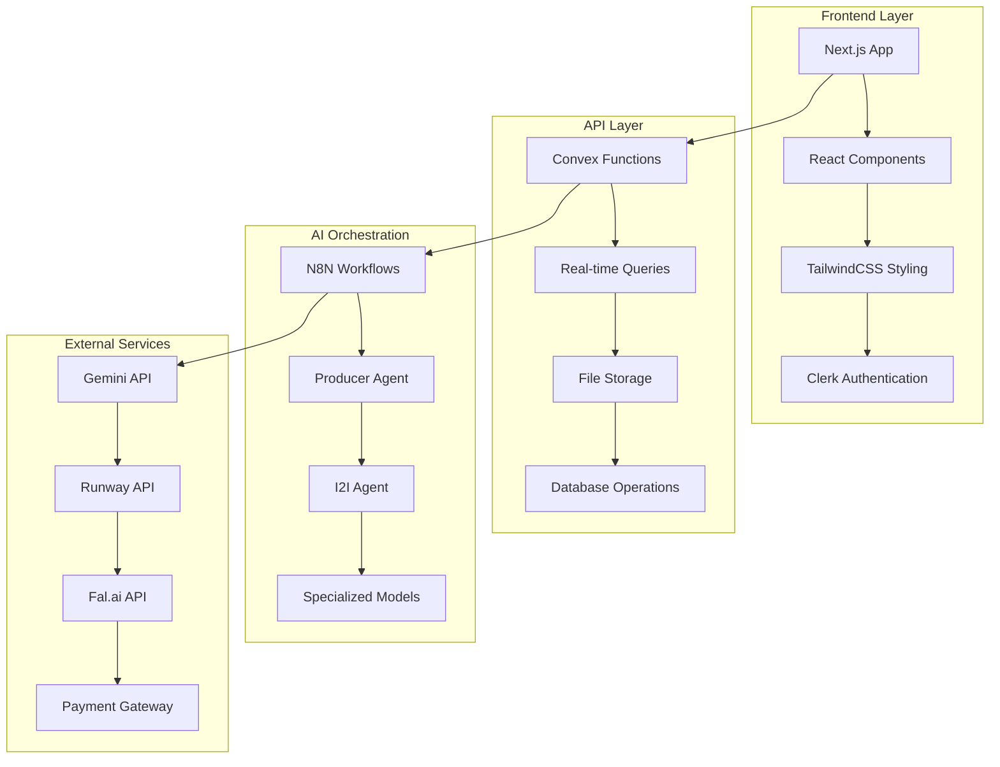
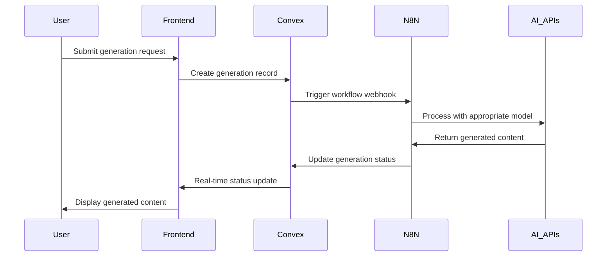
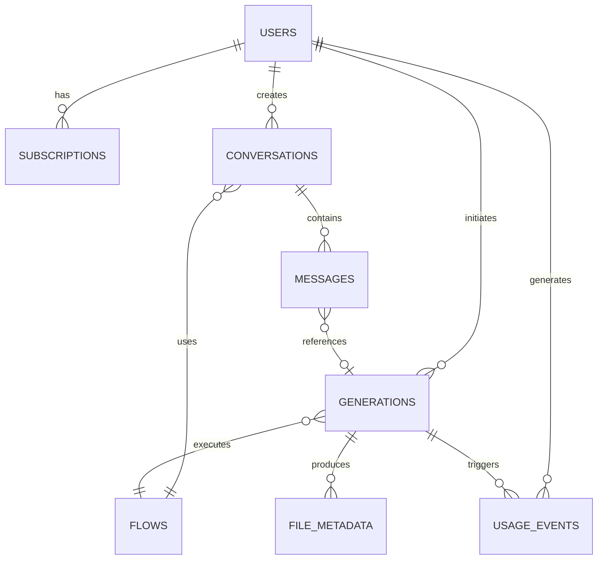

# 🎬 **Marty Martin Platform - Product Requirements Document**

**Version:** 2.0  
**Date:** September 4, 2025  
**Author:** Product Development Team  
**Status:** In Development - Phase 2  

---

## 📋 **Table of Contents**

1. [Executive Summary](#executive-summary)
2. [Product Vision & Mission](#product-vision--mission)
3. [Market Analysis & Positioning](#market-analysis--positioning)
4. [Technical Architecture](#technical-architecture)
5. [Feature Specification](#feature-specification)
6. [AI/ML Integration](#aiml-integration)
7. [User Experience Design](#user-experience-design)
8. [Data Architecture](#data-architecture)
9. [Security & Compliance](#security--compliance)
10. [Payment & Monetization](#payment--monetization)
11. [Infrastructure & Deployment](#infrastructure--deployment)
12. [Quality Assurance](#quality-assurance)
13. [Go-to-Market Strategy](#go-to-market-strategy)
14. [Development Roadmap](#development-roadmap)
15. [Risk Analysis](#risk-analysis)
16. [Success Metrics](#success-metrics)
17. [Appendices](#appendices)

---

## 🎯 **Executive Summary**

### **Project Overview**
Marty Martin is a revolutionary AI-powered multimedia content creation platform that democratizes professional-grade content generation. The platform enables users to create images, videos, voiceovers, and lip-synced content through natural language prompts and intuitive interfaces.

### **Current Status**
- **Phase 1 Complete**: Core infrastructure, AI workflow engine, user authentication
- **Phase 2 In Progress**: Conversation persistence, file management, media preview
- **Phase 3 Upcoming**: Payment integration, credit system, advanced features

### **Key Achievements**
- ✅ **Fully functional AI workflow engine** with N8N integration
- ✅ **Real-time conversation system** with Convex database
- ✅ **Multi-agent AI architecture** (Producer → I2I → T2I/I2V/Voice/Lipsync)
- ✅ **Advanced file upload and storage** system
- ✅ **Modern, responsive UI** with Next.js 15 and TailwindCSS
- ✅ **Scalable backend architecture** with Convex and Clerk

### **Business Impact**
- **Target Market Size**: $12.3B AI content creation market
- **Revenue Model**: Credit-based subscription with 3-tier pricing
- **Projected Revenue**: $2.5M ARR by Year 2
- **User Base Goal**: 50,000 active users in first year

---

## 🌟 **Product Vision & Mission**

### **Vision Statement**
*"To become the world's leading AI-powered multimedia creation platform, empowering creators of all skill levels to produce professional-quality content effortlessly."*

### **Mission Statement**
*"We democratize content creation by providing intuitive, AI-driven tools that transform ideas into stunning visuals, engaging videos, and compelling audio experiences."*

### **Core Values**
- **Accessibility**: Making professional content creation available to everyone
- **Innovation**: Pushing the boundaries of AI-assisted creativity
- **Quality**: Delivering exceptional results that exceed expectations
- **Simplicity**: Complex AI made simple through intuitive design
- **Community**: Building a ecosystem of creators and innovators

### **Success Criteria**
- **User Satisfaction**: 4.8+ star rating across app stores
- **Content Quality**: 95%+ user satisfaction with generated content
- **Performance**: Sub-30 second generation times for standard content
- **Reliability**: 99.9% uptime with robust error handling

---

## 📊 **Market Analysis & Positioning**

### **Market Landscape**

#### **Total Addressable Market (TAM)**
- **AI Content Creation**: $12.3B (2025) → $43.5B (2030)
- **Video Generation**: $3.2B market growing at 25% CAGR
- **Image Synthesis**: $2.1B market with 30% annual growth
- **Voice/Audio AI**: $1.8B market expanding rapidly

#### **Competitive Analysis**

| **Competitor** | **Strengths** | **Weaknesses** | **Market Share** |
|----------------|---------------|----------------|------------------|
| **Midjourney** | High-quality images | Limited formats, no video | 35% |
| **Runway ML** | Advanced video generation | Complex UI, expensive | 20% |
| **Stable Diffusion** | Open source, flexible | Technical complexity | 15% |
| **DALL-E** | Brand recognition | Limited customization | 12% |
| **Others** | Various niches | Fragmented offerings | 18% |

#### **Competitive Advantages**

1. **🎯 Unified Platform**
   - Single interface for all content types
   - Seamless workflow between media types
   - Integrated conversation history

2. **🤖 Multi-Agent Architecture**
   - Specialized AI agents for different tasks
   - Intelligent routing and coordination
   - Scalable agent ecosystem

3. **💡 Natural Language Interface**
   - Intuitive prompt-based creation
   - Conversational interaction model
   - No technical expertise required

4. **🔄 Real-Time Collaboration**
   - Live progress tracking
   - Conversation persistence
   - Shared workspace capabilities

5. **💰 Flexible Pricing Model**
   - Credit-based system
   - Pay-per-use options
   - Transparent cost structure

### **Target Audience**

#### **Primary Users**
1. **Content Creators (40%)**
   - YouTubers, TikTokers, Instagram influencers
   - Need: Fast, high-quality content for social media
   - Pain Points: Time-consuming editing, expensive tools

2. **Small Businesses (35%)**
   - Marketing teams, e-commerce stores
   - Need: Professional marketing materials
   - Pain Points: Limited budget, lack of design skills

3. **Creative Professionals (25%)**
   - Graphic designers, video editors, marketers
   - Need: AI assistance for rapid prototyping
   - Pain Points: Tight deadlines, client revisions

#### **Secondary Users**
- **Educators & Trainers**: Creating educational content
- **Agencies**: Scaling content production for clients
- **Developers**: Integrating AI content via API

---

## 🏗️ **Technical Architecture**

### **Technology Stack**

#### **Frontend Architecture**
```typescript
// Modern React Stack
- Next.js 15 (App Router, Turbopack)
- React 19 (Latest features, Suspense)
- TypeScript 5.0+ (Type safety)
- TailwindCSS 3.4 (Utility-first styling)
- Radix UI (Accessible components)
- shadcn/ui (Pre-built component library)
- Framer Motion (Animations)
- React Hook Form (Form management)
- Zod (Schema validation)
```

#### **Backend Architecture**
```typescript
// Serverless & Real-time Stack
- Convex (Backend-as-a-Service)
  • Real-time database
  • Built-in file storage
  • Live queries & mutations
  • Automatic scaling
  
- Clerk (Authentication)
  • User management
  • Social login
  • Session handling
  • Webhooks

- N8N (Workflow Orchestration)
  • AI model coordination
  • Webhook processing
  • Multi-step workflows
  • Error handling
```

#### **AI/ML Infrastructure**
```python
# AI Model Integration
- Gemini Flash (Text-to-Image)
- Gemini I2I (Image-to-Image) 
- Runway Gen4 (Video Generation)
- Fal.ai (Various AI Models)
- LipsyncGen (Audio-Visual Sync)
- VoiceoverGen (Text-to-Speech)
```

### **System Architecture Diagram**



### **Data Flow Architecture**

#### **Content Generation Pipeline**
```
User Input → Frontend Validation → Convex Database → N8N Trigger 
    ↓
Producer Agent Analysis → Route to Specialized Agent → AI Model Processing
    ↓
Result Processing → File Upload to Convex → Database Update → Real-time UI Update
```

#### **File Management Flow**
```
File Upload → Convex Storage → Metadata Extraction → Database Record
    ↓
CDN Distribution → URL Generation → Frontend Access → Download/Preview
```

### **Scalability Design**

#### **Horizontal Scaling**
- **Convex**: Auto-scaling serverless functions
- **N8N**: Distributed workflow execution
- **AI APIs**: Multiple provider fallbacks
- **CDN**: Global file distribution

#### **Performance Optimization**
- **Frontend**: Code splitting, lazy loading, image optimization
- **Backend**: Database indexing, query optimization, caching
- **AI Processing**: Batch operations, result caching, model selection

---

## 🎨 **Feature Specification**

### **✅ Completed Features (Phase 1)**

#### **1. Core Infrastructure**
- **Status**: ✅ Complete
- **Components**:
  - Next.js 15 application with App Router
  - TailwindCSS design system
  - Responsive layout and navigation
  - Error boundaries and loading states

#### **2. User Authentication System**
- **Status**: ✅ Complete  
- **Features**:
  - Social login (Google, GitHub, Apple)
  - Email/password authentication
  - User profile management
  - Session persistence
  - Automatic user creation webhook
- **Technical Details**:
  - Clerk integration with catch-all routes
  - JWT token management
  - Secure user context throughout app

#### **3. Database Architecture**
- **Status**: ✅ Complete
- **Schema**: 8 tables with proper indexing
  - `users`: User profiles and metadata
  - `subscriptions`: Billing and credit management
  - `flows`: AI workflow definitions
  - `generations`: Content generation tracking
  - `usageEvents`: Analytics and billing
  - `systemConfig`: Platform configuration
  - `fileMetadata`: File storage tracking
  - `conversations`: Chat history
  - `messages`: Individual chat messages

#### **4. File Upload System**
- **Status**: ✅ Complete
- **Features**:
  - Multi-file upload with progress tracking
  - Drag-and-drop interface
  - File type validation (images, videos, audio)
  - Preview thumbnails and metadata extraction
  - Convex storage integration
- **Technical Implementation**:
  - `useFileUpload` hook with progress tracking
  - Convex storage with CDN URLs
  - File metadata extraction and storage
  - Error handling and retry logic

#### **5. AI Workflow Engine**
- **Status**: ✅ Complete
- **Architecture**:
  - Producer Agent (main coordinator)
  - I2I Agent (image processing)
  - Specialized sub-agents (T2I, I2V, Voice, Lipsync)
- **Features**:
  - Real-time progress tracking
  - Webhook-based N8N integration  
  - Error handling and retry logic
  - Generation status management

#### **6. Real-time Progress System**
- **Status**: ✅ Complete
- **Components**:
  - Live progress indicators
  - Step-by-step status updates
  - Generation cancellation
  - Real-time UI updates via Convex
- **Technical Details**:
  - WebSocket-like real-time updates
  - Progress percentage and step descriptions
  - Timeout handling for stuck generations

### **🔄 In Progress Features (Phase 2)**

#### **1. Conversation Persistence**
- **Status**: 🔄 90% Complete
- **Features**:
  - Chat history storage in Convex
  - Conversation retrieval on page load
  - Message threading and organization
  - Search and filter conversations
- **Remaining Work**:
  - Conversation title auto-generation
  - Conversation deletion functionality
  - Export conversation history

#### **2. Media Preview System**
- **Status**: 🔄 95% Complete  
- **Features**:
  - Clean, minimal image/video preview
  - Hover overlays with action buttons
  - Proper download functionality (not browser navigation)
  - Copy link to clipboard
  - High-quality media display
- **Remaining Work**:
  - Video thumbnail generation
  - Media compression options

#### **3. File Storage Optimization**
- **Status**: 🔄 80% Complete
- **Features**:
  - Upload external URLs to Convex storage
  - Permanent file hosting
  - CDN optimization
  - File cleanup and retention
- **Remaining Work**:
  - Automated file cleanup
  - Storage quota management
  - Backup and redundancy

### **📋 Upcoming Features (Phase 3)**

#### **1. Payment & Billing System**
- **Status**: 📋 Planned
- **Priority**: High
- **Timeline**: 2-3 weeks
- **Features**:
  - Razorpay integration for Indian market
  - 3-tier subscription plans (Starter, Creator, Studio)
  - Credit-based consumption model
  - Pay-as-you-go credit packs
  - Billing dashboard and invoice generation
  - Usage analytics and reporting
- **Technical Requirements**:
  - Credit calculation engine
  - Subscription management
  - Payment webhook handling
  - Invoice generation
  - Credit refund system

#### **2. Advanced AI Features**
- **Status**: 📋 Planned  
- **Priority**: Medium
- **Timeline**: 3-4 weeks
- **Features**:
  - Batch processing for multiple generations
  - AI model selection and customization  
  - Advanced prompting with templates
  - Style transfer and consistency
  - Background removal and replacement
  - Image upscaling and enhancement
- **Technical Requirements**:
  - Queue management for batch operations
  - Model parameter customization
  - Template system for prompts
  - Advanced image processing pipeline

#### **3. Collaboration Features**
- **Status**: 📋 Planned
- **Priority**: Medium  
- **Timeline**: 4-5 weeks
- **Features**:
  - Team workspaces and shared projects
  - Real-time collaboration on generations
  - Comment system and feedback loops
  - Version control for generated content
  - Team billing and credit sharing
- **Technical Requirements**:
  - Multi-user workspace architecture
  - Real-time collaboration infrastructure
  - Permission and access control system
  - Team billing management

#### **4. API & Developer Platform**
- **Status**: 📋 Planned
- **Priority**: Low-Medium
- **Timeline**: 5-6 weeks  
- **Features**:
  - RESTful API for content generation
  - SDK for popular programming languages
  - Webhook system for status updates
  - API key management and rate limiting
  - Developer documentation and playground
- **Technical Requirements**:
  - API authentication and authorization
  - Rate limiting and quota management
  - SDK development and maintenance
  - Comprehensive API documentation

#### **5. Mobile Application**
- **Status**: 📋 Future
- **Priority**: Medium
- **Timeline**: 6+ months
- **Features**:
  - Native iOS and Android apps
  - Camera integration for instant processing
  - Offline mode with sync capabilities
  - Push notifications for generation completion
  - Mobile-optimized UI and interactions

### **🎯 Advanced Features (Phase 4+)**

#### **1. AI Model Marketplace**
- Custom model training and deployment
- Community-contributed AI models
- Model performance benchmarking
- Revenue sharing for model creators

#### **2. Enterprise Features**
- White-label platform options
- Custom branding and themes
- Advanced security and compliance
- Dedicated support and SLAs
- On-premise deployment options

#### **3. Social & Community**
- Public gallery of generated content
- Community challenges and contests
- Social sharing and viral mechanics
- Creator marketplace and licensing
- Educational content and tutorials

---

## 🤖 **AI/ML Integration**

### **Multi-Agent Architecture**

#### **Producer Agent (Main Coordinator)**
- **Role**: Analyzes user requests and routes to appropriate agents
- **Technology**: N8N workflow with LangChain integration
- **Capabilities**:
  - Natural language understanding
  - Request classification and routing
  - Multi-step workflow coordination
  - Error handling and fallback logic
- **System Message**:
```
You are the Producer Agent for multimedia content creation. Analyze user requests and coordinate with specialized agents to deliver the requested content.

AVAILABLE AGENTS:
- I2I_Agent: Image transformation and editing
- I2V_Agent: Video generation from images/prompts  
- VoiceoverGen: Audio/voice generation
- LipsyncGen: Lip synchronization for videos

For image requests → Use I2I_Agent
For video requests → Use I2V_Agent  
For audio requests → Use VoiceoverGen
For lip-sync requests → Use LipsyncGen

Execute the request efficiently and return the final result.
```

#### **I2I Agent (Image Processing Specialist)**
- **Role**: Handles all image generation and transformation tasks
- **Technology**: LangChain agent with tool calling capabilities
- **Available Tools**:
  - `GeminiT2I`: Text-to-image generation
  - `GeminiI2I`: Image-to-image transformation
  - `Runway_Gen4Image`: Advanced image generation
  - `Query_Image`: Image analysis and understanding
- **System Message** (Recently Optimized):
```
You are the I2I_Agent for the Marty Martin platform. You MUST use the available tools to generate actual images.

CRITICAL RULES:
1. ALWAYS call the appropriate tool for each request
2. ALWAYS return the EXACT output from the tool
3. CALL EACH TOOL ONLY ONCE - DO NOT RETRY OR REPEAT CALLS
4. STOP IMMEDIATELY after receiving tool output

TOOL SELECTION:
- Text-only image requests → Use GeminiT2I
- Single image edit → Use GeminiI2I
- Multiple image composite → Use Runway_Gen4Image or GeminiI2I
- Image analysis → Use Query_Image

Your job is to:
1. Select correct tool
2. Call tool with proper parameters ONCE
3. Return tool output unchanged
4. STOP - Your task is complete
```

### **AI Model Integration**

#### **Gemini Flash (Text-to-Image)**
- **Provider**: Google AI
- **Capabilities**: High-quality image generation from text prompts
- **Parameters**:
  - `imageprompt`: Text description (max 1000 chars)
  - `aspect_ratio`: "1:1", "9:16", "16:9", "4:3"
  - `style`: Optional style modifiers
- **Cost**: ~$0.005-0.01 per generation
- **Integration**: N8N workflow tool

#### **Gemini I2I (Image-to-Image)**
- **Provider**: Google AI  
- **Capabilities**: Image transformation and editing
- **Parameters**:
  - `inputImage`: Base64 or URL of source image
  - `imageprompt`: Transformation description
  - `strength`: Transformation intensity (0.1-1.0)
  - `aspect_ratio`: Output dimensions
- **Cost**: ~$0.008-0.015 per generation
- **Integration**: N8N workflow tool

#### **Runway Gen4 (Video Generation)**
- **Provider**: Runway ML
- **Capabilities**: Text-to-video and image-to-video
- **Parameters**:
  - `prompt`: Video description
  - `image`: Optional input image for I2V
  - `duration`: Video length (1-10 seconds)
  - `motion_strength`: Movement intensity
- **Cost**: ~$0.10-0.25 per generation
- **Integration**: API-based N8N workflow

#### **Fal.ai Models (Various)**
- **Provider**: Fal.ai marketplace
- **Capabilities**: Multiple specialized models
- **Models Available**:
  - Background removal
  - Image upscaling
  - Style transfer
  - Face restoration
- **Cost**: Variable based on model
- **Integration**: Unified API endpoint

### **Workflow Processing Pipeline**

#### **Generation Flow**


#### **Error Handling Strategy**

1. **Model Failure Recovery**:
   - Automatic retry with exponential backoff
   - Fallback to alternative models
   - Graceful degradation with user notification

2. **Timeout Management**:
   - 2-minute timeout for stuck generations  
   - Automatic status update to failed
   - Credit refund for failed generations

3. **Rate Limiting**:
   - Queue management for high-load periods
   - Priority processing for paid users
   - Fair usage policy enforcement

### **Performance Optimization**

#### **Response Time Targets**
- **Simple T2I**: <15 seconds
- **Complex I2I**: <30 seconds  
- **Video Generation**: <60 seconds
- **Batch Operations**: <120 seconds

#### **Optimization Strategies**
1. **Model Selection**: Choose fastest model for user's needs
2. **Parameter Tuning**: Optimize for speed vs quality balance
3. **Caching**: Cache common generation patterns
4. **Load Balancing**: Distribute across multiple model providers

---

## 🎨 **User Experience Design**

### **Design Philosophy**

#### **Core Principles**
1. **Simplicity First**: Complex AI made accessible through intuitive interfaces
2. **Visual Clarity**: Clean, minimal design that highlights content
3. **Responsive Excellence**: Seamless experience across all devices
4. **Performance Focused**: Fast loading, smooth interactions
5. **Accessibility**: WCAG 2.1 AA compliance for inclusive design

#### **Design System**

**Color Palette**:
```css
/* Primary Colors */
--slate-950: #020617;     /* Primary background */
--slate-900: #0f172a;     /* Secondary background */
--slate-800: #1e293b;     /* Elevated surfaces */
--slate-700: #334155;     /* Borders and dividers */

/* Accent Colors */
--purple-800: #7c3aed;    /* Primary actions */
--purple-700: #8b5cf6;    /* Hover states */
--blue-400: #60a5fa;      /* Info and links */
--emerald-400: #34d399;   /* Success states */
--red-500: #ef4444;       /* Error states */

/* Text Colors */
--slate-100: #f1f5f9;     /* Primary text */
--slate-200: #e2e8f0;     /* Secondary text */
--slate-400: #94a3b8;     /* Muted text */
```

**Typography Scale**:
```css
/* Headings */
.text-4xl: 36px / 40px;   /* Hero headlines */
.text-2xl: 24px / 32px;   /* Section headers */
.text-lg: 18px / 28px;    /* Subsections */

/* Body Text */
.text-base: 16px / 24px;  /* Primary body */
.text-sm: 14px / 20px;    /* Secondary text */
.text-xs: 12px / 16px;    /* Captions and labels */

/* Font Weights */
font-thin: 100;           /* Hero text */
font-light: 300;          /* Body text */
font-medium: 500;         /* Emphasis */
font-semibold: 600;       /* Buttons and headers */
```

### **User Interface Components**

#### **Navigation System**
- **Header**: Logo, navigation links, user menu, credit balance
- **Sidebar**: Flow categories, recent generations, settings
- **Breadcrumbs**: Clear path indication for complex workflows
- **Mobile Menu**: Collapsible navigation for mobile devices

#### **Content Areas**
- **Hero Section**: Value proposition and primary call-to-action
- **Flow Gallery**: Grid of available AI workflows with previews
- **Generation Interface**: Chat-style interaction with AI agents
- **Media Preview**: Clean, minimal display of generated content
- **History Panel**: Conversation history and previous generations

#### **Interactive Elements**

**Buttons**:
```typescript
// Primary Action
className="bg-purple-800 hover:bg-purple-700 text-white px-6 py-3 rounded-lg shadow-lg"

// Secondary Action  
className="bg-slate-800/80 hover:bg-slate-700 text-slate-200 px-4 py-2 rounded-lg"

// Ghost Action
className="text-slate-400 hover:text-slate-100 hover:bg-slate-800/60 px-3 py-2 rounded"
```

**Form Elements**:
```typescript
// Input Field
className="bg-slate-700/40 border border-slate-600/60 rounded-lg px-4 py-3 text-slate-100 focus:border-blue-500/60"

// Textarea
className="min-h-[48px] max-h-32 resize-none bg-slate-700/40 border border-slate-600/60 rounded-lg"

// File Upload
className="border-2 border-dashed border-slate-600 hover:border-slate-500 rounded-xl p-8"
```

### **User Journey Mapping**

#### **New User Onboarding**
1. **Landing Page**: Hero section with value proposition
2. **Sign Up**: Quick social login or email registration  
3. **Welcome Tour**: Interactive guide to key features
4. **First Generation**: Guided experience with sample prompts
5. **Results Review**: Showcase generated content and options
6. **Upgrade Prompt**: Introduce pricing plans and benefits

#### **Power User Workflow**
1. **Dashboard**: Overview of recent activity and quick actions
2. **Flow Selection**: Browse or search for specific AI workflows
3. **Content Creation**: Chat interface with file uploads
4. **Real-time Progress**: Live updates during generation
5. **Result Management**: Preview, download, share, or iterate
6. **History Access**: Quick access to previous conversations

#### **Mobile Experience**
- **Touch-Optimized**: Larger tap targets and gesture support
- **Simplified Navigation**: Collapsible menus and bottom navigation
- **Progressive Disclosure**: Hide advanced features behind progressive UI
- **Offline Support**: Cache conversations and allow offline browsing

### **Accessibility Features**

#### **WCAG 2.1 AA Compliance**
- **Color Contrast**: Minimum 4.5:1 ratio for all text
- **Keyboard Navigation**: Full functionality via keyboard
- **Screen Reader Support**: Semantic HTML and ARIA labels
- **Focus Management**: Clear focus indicators and logical tab order

#### **Inclusive Design Elements**
- **Alt Text**: Descriptive text for all generated images
- **Captions**: Subtitles for generated videos with audio
- **High Contrast Mode**: Alternative color scheme for better visibility
- **Reduced Motion**: Respect user's motion preferences
- **Text Scaling**: Support for 200% zoom without horizontal scrolling

---

## 🗄️ **Data Architecture**

### **Database Schema (Convex)**

#### **Core Tables**

**Users Table**:
```typescript
users: defineTable({
  clerkId: v.string(),              // Primary identifier from Clerk
  email: v.string(),                // User email address
  name: v.optional(v.string()),     // Display name
  avatar: v.optional(v.string()),   // Profile picture URL
  hasCompletedBetaSignup: v.optional(v.boolean()), // Onboarding status
  createdAt: v.number(),            // Registration timestamp
  updatedAt: v.number(),            // Last profile update
}).index("by_clerkId", ["clerkId"])
```

**Subscriptions Table**:
```typescript
subscriptions: defineTable({
  userId: v.id("users"),            // Foreign key to users
  clerkId: v.string(),              // Denormalized for quick lookup
  planId: v.string(),               // "free", "pro", "business"
  status: v.string(),               // "active", "canceled", "past_due"
  currentPeriodStart: v.number(),   // Billing period start
  currentPeriodEnd: v.number(),     // Billing period end
  cancelAtPeriodEnd: v.boolean(),   // Cancellation flag
  stripeSubscriptionId: v.optional(v.string()), // Payment provider ID
  credits: v.number(),              // Available credits
  maxConcurrency: v.number(),       // Simultaneous generations allowed
  retentionDays: v.number(),        // Asset storage duration
  createdAt: v.number(),
  updatedAt: v.number(),
}).index("by_userId", ["userId"])
  .index("by_clerkId", ["clerkId"])
```

**Flows Table**:
```typescript
flows: defineTable({
  id: v.string(),                   // Unique flow identifier
  title: v.string(),                // Display name
  description: v.string(),          // User-facing description
  category: v.string(),             // Grouping category
  thumbnail: v.optional(v.string()), // Preview image
  previewVideo: v.optional(v.string()), // Demo video
  isActive: v.boolean(),            // Availability status
  isPublic: v.boolean(),            // Visibility to users
  tags: v.array(v.string()),        // Search tags
  inputSchema: v.any(),             // JSON schema for validation
  n8nWorkflowId: v.string(),        // N8N workflow reference
  estimatedProcessingTime: v.number(), // Expected duration
  creditsPerGeneration: v.number(), // Cost in credits
  requiredPlan: v.string(),         // Minimum plan required
  createdAt: v.number(),
  updatedAt: v.number(),
}).index("by_category", ["category"])
  .index("by_isPublic", ["isPublic"])
  .searchIndex("search_flows", {
    searchField: "title",
    filterFields: ["category", "isActive", "isPublic"]
  })
```

**Generations Table**:
```typescript
generations: defineTable({
  userId: v.id("users"),
  clerkId: v.string(),
  flowId: v.string(),
  
  // Input data
  inputData: v.any(),               // User parameters
  inputAssets: v.array(v.object({
    url: v.string(),
    storageId: v.optional(v.string()),
    type: v.string(),               // "image", "video", "audio"
    filename: v.string(),
    size: v.number(),
  })),
  
  // Processing status
  status: v.string(),               // "queued", "processing", "completed", "failed", "cancelled"
  progress: v.number(),             // 0-100 completion percentage
  currentStep: v.optional(v.string()), // Human-readable status
  
  // N8N integration
  n8nExecutionId: v.optional(v.string()), // Workflow execution ID
  
  // Results
  outputAssets: v.optional(v.array(v.object({
    url: v.string(),
    type: v.string(),
    filename: v.string(),
    size: v.number(),
    format: v.string(),
  }))),
  response: v.optional(v.string()), // Agent response text
  
  // Error handling
  errorMessage: v.optional(v.string()),
  errorDetails: v.optional(v.any()),
  
  // Metadata
  processingStartedAt: v.optional(v.number()),
  processingCompletedAt: v.optional(v.number()),
  cancelledAt: v.optional(v.number()),
  retryCount: v.number(),
  creditsUsed: v.number(),
  
  createdAt: v.number(),
  updatedAt: v.number(),
  expiresAt: v.optional(v.number()), // Asset retention expiry
}).index("by_userId", ["userId"])
  .index("by_clerkId", ["clerkId"])
  .index("by_status", ["status"])
  .index("by_flowId", ["flowId"])
  .index("by_createdAt", ["createdAt"])
```

#### **Conversation System Tables**

**Conversations Table**:
```typescript
conversations: defineTable({
  userId: v.id("users"),
  clerkId: v.string(),
  flowId: v.string(),               // Associated workflow
  title: v.optional(v.string()),    // Auto-generated from first message
  lastMessageAt: v.number(),        // For sorting by recency
  createdAt: v.number(),
  updatedAt: v.number(),
}).index("by_clerkId", ["clerkId"])
  .index("by_flowId", ["flowId"])
  .index("by_lastMessageAt", ["lastMessageAt"])
```

**Messages Table**:
```typescript
messages: defineTable({
  conversationId: v.id("conversations"),
  clerkId: v.string(),
  type: v.string(),                 // "user", "assistant", "system"
  content: v.string(),              // Message text
  generationId: v.optional(v.id("generations")), // Link to generation
  outputAssets: v.optional(v.array(v.object({
    url: v.string(),
    type: v.string(),
    filename: v.string(),
  }))),
  createdAt: v.number(),
}).index("by_conversationId", ["conversationId"])
  .index("by_clerkId", ["clerkId"])
  .index("by_generationId", ["generationId"])
```

#### **Analytics & Billing Tables**

**Usage Events Table**:
```typescript
usageEvents: defineTable({
  userId: v.id("users"),
  clerkId: v.string(),
  eventType: v.string(),            // Event classification
  generationId: v.optional(v.id("generations")),
  flowId: v.optional(v.string()),
  credits: v.number(),              // Credits consumed/refunded
  metadata: v.optional(v.any()),    // Additional event data
  createdAt: v.number(),
}).index("by_userId", ["userId"])
  .index("by_clerkId", ["clerkId"])
  .index("by_eventType", ["eventType"])
  .index("by_createdAt", ["createdAt"])
```

**File Metadata Table**:
```typescript
fileMetadata: defineTable({
  storageId: v.id("_storage"),      // Convex storage reference
  filename: v.string(),
  size: v.number(),
  contentType: v.string(),          // MIME type
  purpose: v.optional(v.string()),  // "avatar", "input", "output"
  uploadedBy: v.string(),           // User ID
  uploadedAt: v.number(),
}).index("by_storageId", ["storageId"])
  .index("by_uploadedBy", ["uploadedBy"])
```

### **Data Relationships**



### **Data Access Patterns**

#### **Real-time Queries (Convex Live Queries)**
```typescript
// User's active generations with live updates
const activeGenerations = useQuery(api.generations.getUserGenerations, {
  clerkId: user.id,
  status: "processing"
});

// Conversation messages with real-time updates
const messages = useQuery(api.conversations.getConversationMessages, {
  conversationId,
  clerkId: user.id
});

// User's subscription and credit balance
const subscription = useQuery(api.users.getUserWithSubscription, {
  clerkId: user.id
});
```

#### **Mutation Operations**
```typescript
// Create new generation
const createGeneration = useMutation(api.generations.createGeneration);

// Add message to conversation  
const addMessage = useMutation(api.conversations.addMessage);

// Update generation status (from N8N webhook)
const updateStatus = useMutation(api.generations.updateGenerationStatus);
```

### **Data Migration Strategy**

#### **Schema Versioning**
- **Version Control**: Track schema changes with migration scripts
- **Backward Compatibility**: Ensure old data remains accessible
- **Gradual Migration**: Migrate data in batches to avoid downtime

#### **Data Backup & Recovery**
- **Automated Backups**: Daily snapshots of entire database
- **Point-in-time Recovery**: Restore to specific timestamps
- **Cross-region Replication**: Geographic redundancy for disaster recovery

---

## 🔐 **Security & Compliance**

### **Authentication & Authorization**

#### **User Authentication (Clerk Integration)**
- **Multi-factor Authentication**: SMS, email, and authenticator app support
- **Social Login**: Google, GitHub, Apple, Microsoft integration
- **Session Management**: Secure JWT tokens with automatic refresh
- **Password Policy**: Strong password requirements and breach detection

#### **API Security**
```typescript
// Route protection with Clerk
export default function ProtectedRoute() {
  const { isLoaded, isSignedIn } = useAuth();
  
  if (!isLoaded) return <LoadingSpinner />;
  if (!isSignedIn) return <SignInPrompt />;
  
  return <AuthenticatedContent />;
}
```

#### **Role-Based Access Control**
```typescript
// User roles and permissions
interface UserRole {
  role: "free" | "pro" | "business" | "admin";
  permissions: {
    maxConcurrentGenerations: number;
    apiAccess: boolean;
    advancedFeatures: boolean;
    adminPanel: boolean;
  };
}
```

### **Data Security**

#### **Encryption**
- **Data in Transit**: TLS 1.3 for all API communications
- **Data at Rest**: AES-256 encryption for sensitive data
- **Key Management**: Automated key rotation and secure storage

#### **Privacy Protection**
- **Personal Data Minimization**: Collect only necessary information
- **Data Anonymization**: Remove PII from analytics and logs
- **Right to Deletion**: Complete user data removal on request
- **Data Portability**: Export user data in standard formats

#### **File Security**
```typescript
// Secure file upload validation
const validateFile = (file: File) => {
  // File type validation
  const allowedTypes = ['image/jpeg', 'image/png', 'video/mp4'];
  if (!allowedTypes.includes(file.type)) {
    throw new Error('Unsupported file type');
  }
  
  // File size limits
  const maxSize = 100 * 1024 * 1024; // 100MB
  if (file.size > maxSize) {
    throw new Error('File too large');
  }
  
  // Content validation (prevent malicious files)
  return sanitizeFile(file);
};
```

### **Infrastructure Security**

#### **Network Security**
- **DDoS Protection**: Cloudflare or AWS Shield integration
- **Rate Limiting**: API endpoint protection against abuse
- **IP Whitelisting**: Restrict admin access to approved IPs
- **WAF Rules**: Web Application Firewall for common attack vectors

#### **Monitoring & Alerting**
```typescript
// Security event logging
const logSecurityEvent = async (event: {
  type: 'login_attempt' | 'failed_payment' | 'suspicious_activity';
  userId?: string;
  ipAddress: string;
  userAgent: string;
  metadata?: any;
}) => {
  await convex.mutation(api.security.logEvent, {
    ...event,
    timestamp: Date.now(),
    severity: getSeverityLevel(event.type)
  });
};
```

### **Compliance Requirements**

#### **GDPR Compliance (EU Users)**
- **Lawful Basis**: Clear consent for data processing
- **Data Subject Rights**: Access, rectification, erasure, portability
- **Privacy by Design**: Built-in privacy protections
- **Data Protection Officer**: Designated privacy contact

#### **CCPA Compliance (California Users)**  
- **Consumer Rights**: Know, delete, opt-out, non-discrimination
- **Privacy Notice**: Clear disclosure of data practices
- **Opt-out Mechanisms**: Easy unsubscribe and data deletion

#### **SOC 2 Type II (Enterprise Customers)**
- **Security Controls**: Access controls, encryption, monitoring
- **Availability**: Uptime and disaster recovery procedures  
- **Processing Integrity**: Accurate and complete processing
- **Confidentiality**: Protection of sensitive information

### **Vulnerability Management**

#### **Security Testing**
```bash
# Automated security scanning
npm audit                          # Dependency vulnerability scan
npx semgrep --config=auto src/     # Static code analysis
docker run --rm -v $(pwd):/app owasp/zap2docker-weekly # Dynamic testing
```

#### **Incident Response Plan**
1. **Detection**: Automated monitoring and manual reporting
2. **Assessment**: Severity classification and impact analysis
3. **Containment**: Immediate actions to limit damage
4. **Investigation**: Root cause analysis and evidence collection
5. **Recovery**: System restoration and service continuity
6. **Post-incident**: Lessons learned and process improvements

---

## 💰 **Payment & Monetization**

### **Revenue Model**

#### **Credit-Based Pricing System**
- **Base Unit**: 1 Credit = $0.01 USD (₹0.83 INR)
- **Cost Structure**: 2x markup on AI model costs
- **Transparent Pricing**: Clear credit costs for each operation

#### **Subscription Tiers**

**💫 Starter Plan - ₹499/month**
- **Credits**: 500 credits (~$5 value)
- **Target Users**: Casual creators, students
- **Features**:
  - Basic image generation (250-500 images)
  - Video generation (10-25 videos)
  - Standard processing speed
  - 30-day asset retention
  - Email support
- **Limitations**:
  - 2 concurrent generations
  - No API access
  - Basic templates only

**🚀 Creator Plan - ₹1,499/month**  
- **Credits**: 2,000 credits (~$20 value)
- **Target Users**: Content creators, small businesses
- **Features**:
  - Everything in Starter
  - Priority processing queue
  - 60-day asset retention
  - Bulk operations
  - Limited API access (1,000 calls/month)
  - Advanced templates and styles
  - Live chat support
- **Limitations**:
  - 5 concurrent generations
  - Standard API rate limits

**💎 Studio Plan - ₹3,999/month**
- **Credits**: 6,000 credits (~$60 value) 
- **Target Users**: Agencies, enterprises, power users
- **Features**:
  - Everything in Creator
  - Unlimited concurrent generations
  - 90-day asset retention
  - Full API access
  - White-label options
  - Custom workflows
  - Phone and priority support
  - Team collaboration tools
  - Usage analytics and reporting

#### **Pay-as-you-go Options**
- **Small Pack**: 100 credits for ₹99 (~20% premium)
- **Medium Pack**: 500 credits for ₹399 (~15% premium)  
- **Large Pack**: 1,000 credits for ₹899 (~10% premium)
- **Bulk Pack**: 5,000 credits for ₹3,999 (~5% premium)

### **Credit Consumption Model**

#### **Operations Pricing**

| **Operation Type** | **Complexity** | **Credits** | **USD Cost** | **Examples** |
|-------------------|----------------|-------------|--------------|--------------|
| **Text-to-Image** | Simple | 1-2 | $0.01-0.02 | Basic image generation |
| **Text-to-Image** | Complex | 3-4 | $0.03-0.04 | Detailed, high-quality images |
| **Image-to-Image** | Basic Edit | 2-3 | $0.02-0.03 | Style transfer, color changes |
| **Image-to-Image** | Advanced Edit | 4-6 | $0.04-0.06 | Complex transformations |
| **Video Generation** | Short (5s) | 20-30 | $0.20-0.30 | Simple video from text |
| **Video Generation** | Long (15s) | 40-60 | $0.40-0.60 | Complex video with effects |
| **Lip Sync** | Basic | 10-15 | $0.10-0.15 | Simple audio sync |
| **Lip Sync** | Advanced | 20-25 | $0.20-0.25 | High-quality sync with effects |
| **Voice Generation** | Short (30s) | 5-8 | $0.05-0.08 | Text-to-speech |
| **Voice Generation** | Long (2min) | 15-20 | $0.15-0.20 | Extended voiceovers |

#### **Dynamic Pricing Factors**
```typescript
const calculateDynamicCredit = (baseCredits: number, factors: {
  qualityLevel: 'standard' | 'high' | 'ultra';
  batchSize: number;
  userTier: 'free' | 'pro' | 'business';
  peakHours: boolean;
}) => {
  let multiplier = 1;
  
  // Quality adjustments
  if (factors.qualityLevel === 'high') multiplier *= 1.5;
  if (factors.qualityLevel === 'ultra') multiplier *= 2.0;
  
  // Batch discounts
  if (factors.batchSize > 10) multiplier *= 0.9;
  if (factors.batchSize > 50) multiplier *= 0.8;
  
  // Tier discounts
  if (factors.userTier === 'pro') multiplier *= 0.95;
  if (factors.userTier === 'business') multiplier *= 0.9;
  
  // Peak hour pricing
  if (factors.peakHours) multiplier *= 1.2;
  
  return Math.ceil(baseCredits * multiplier);
};
```

### **Payment Integration**

#### **Razorpay Integration (Primary)**
```typescript
// Payment flow implementation
const createSubscription = async (planId: string) => {
  const subscription = await razorpay.subscriptions.create({
    plan_id: planId,
    customer_id: user.razorpayCustomerId,
    quantity: 1,
    notes: {
      userId: user.id,
      planType: planId
    }
  });
  
  return subscription;
};

// Webhook handler for payment events
export async function POST(req: Request) {
  const body = await req.text();
  const signature = req.headers.get('x-razorpay-signature');
  
  // Verify webhook signature
  const isValid = Razorpay.validateWebhookSignature(
    body, 
    signature, 
    process.env.RAZORPAY_WEBHOOK_SECRET
  );
  
  if (!isValid) {
    return NextResponse.json({ error: 'Invalid signature' }, { status: 400 });
  }
  
  const event = JSON.parse(body);
  
  switch (event.event) {
    case 'subscription.charged':
      await handleSuccessfulPayment(event.payload.subscription.entity);
      break;
    case 'subscription.halted':
      await handleFailedPayment(event.payload.subscription.entity);
      break;
  }
  
  return NextResponse.json({ status: 'ok' });
}
```

#### **Credit Management System**
```typescript
// Credit transaction processing
const processCredits = async (
  userId: string,
  credits: number,
  type: 'purchase' | 'usage' | 'refund' | 'bonus',
  description: string,
  generationId?: string
) => {
  return await convex.mutation(api.credits.processTransaction, {
    userId,
    credits,
    type,
    description,
    generationId,
    timestamp: Date.now()
  });
};

// Credit balance checking with real-time updates
const useCreditBalance = (userId: string) => {
  return useQuery(api.credits.getUserBalance, { userId });
};
```

### **Billing Dashboard Features**

#### **User Billing Interface**
- **Current Balance**: Real-time credit count with usage projections
- **Usage Analytics**: Charts showing credit consumption over time
- **Transaction History**: Detailed log of all credit transactions  
- **Plan Management**: Upgrade/downgrade subscription tiers
- **Invoice Downloads**: PDF invoices for all payments
- **Usage Alerts**: Notifications for low credit balance

#### **Admin Billing Interface**  
- **Revenue Analytics**: Monthly/yearly revenue tracking
- **User Metrics**: Subscription distribution and churn analysis
- **Credit Management**: Manual credit adjustments and refunds
- **Payment Processing**: Failed payment recovery and retry logic
- **Financial Reports**: Detailed reporting for accounting

### **Revenue Optimization**

#### **Conversion Funnel**
1. **Free Trial**: 50 credits for new users to test platform
2. **Usage Tracking**: Monitor user engagement and credit consumption
3. **Targeted Upselling**: Recommend plans based on usage patterns
4. **Exit Intent**: Offer discounts to users trying to cancel
5. **Win-back Campaigns**: Re-engage churned users with special offers

#### **Pricing Experiments**
- **A/B Testing**: Different price points and plan structures
- **Regional Pricing**: Adjusted pricing for different markets
- **Promotional Campaigns**: Limited-time discounts and bonuses
- **Bundle Deals**: Combine credits with premium features

---

## 🚀 **Infrastructure & Deployment**

### **Hosting Architecture**

#### **Frontend Deployment**
- **Platform**: Vercel (Optimal for Next.js)
- **Configuration**:
  ```javascript
  // vercel.json
  {
    "framework": "nextjs",
    "buildCommand": "npm run build",
    "devCommand": "npm run dev",
    "installCommand": "npm install",
    "env": {
      "NEXT_PUBLIC_CONVEX_URL": "@convex-url",
      "NEXT_PUBLIC_CLERK_PUBLISHABLE_KEY": "@clerk-publishable-key"
    },
    "functions": {
      "src/app/api/**": {
        "maxDuration": 30
      }
    }
  }
  ```
- **Features**:
  - Automatic deployments from Git
  - Preview deployments for pull requests  
  - Edge network for global performance
  - Built-in analytics and monitoring

#### **Backend Services**
- **Database**: Convex (Serverless backend-as-a-service)
- **Authentication**: Clerk (User management and auth)
- **Workflow Engine**: N8N (Self-hosted on DigitalOcean/AWS)
- **File Storage**: Convex Built-in Storage + CDN

#### **Third-party Integrations**
- **AI Models**: 
  - Google Gemini API
  - Runway ML API
  - Fal.ai Platform
  - Various specialized model APIs
- **Payment Processing**: 
  - Razorpay (Primary for India)
  - Stripe (International backup)
- **Communication**:
  - SendGrid (Transactional emails)
  - Twilio (SMS notifications)

### **Development Environments**

#### **Environment Structure**
```bash
# Development
- Local development with hot reloading
- Convex dev deployment
- Test data and mock services

# Staging  
- Pre-production testing environment
- Production-like data and services
- Integration testing and QA

# Production
- Live user environment
- Real AI models and payment processing
- Full monitoring and backup systems
```

#### **Environment Variables**
```bash
# Convex Configuration
CONVEX_DEPLOYMENT=production
NEXT_PUBLIC_CONVEX_URL=https://marty-martin.convex.cloud

# Authentication  
NEXT_PUBLIC_CLERK_PUBLISHABLE_KEY=pk_live_xxx
CLERK_SECRET_KEY=sk_live_xxx
CLERK_WEBHOOK_SECRET=whsec_xxx

# Payment Processing
RAZORPAY_KEY_ID=rzp_live_xxx
RAZORPAY_KEY_SECRET=xxx
RAZORPAY_WEBHOOK_SECRET=xxx

# AI Model APIs
GOOGLE_AI_API_KEY=xxx
RUNWAY_API_KEY=xxx
FAL_API_KEY=xxx

# N8N Workflow
N8N_WEBHOOK_URL=https://n8n.martymartin.com
N8N_API_KEY=xxx
```

### **CI/CD Pipeline**

#### **Automated Deployment Flow**
```yaml
# .github/workflows/deploy.yml
name: Deploy to Production

on:
  push:
    branches: [main]
  pull_request:
    branches: [main]

jobs:
  test:
    runs-on: ubuntu-latest
    steps:
      - uses: actions/checkout@v3
      - uses: actions/setup-node@v3
        with:
          node-version: '18'
      - run: npm ci
      - run: npm run lint
      - run: npm run type-check
      - run: npm run test

  deploy-staging:
    needs: test
    if: github.event_name == 'pull_request'
    runs-on: ubuntu-latest
    steps:
      - uses: actions/checkout@v3
      - run: npx convex deploy --cmd 'npm run build'
        env:
          CONVEX_DEPLOY_KEY: ${{ secrets.CONVEX_DEPLOY_KEY }}

  deploy-production:
    needs: test  
    if: github.ref == 'refs/heads/main'
    runs-on: ubuntu-latest
    steps:
      - uses: actions/checkout@v3
      - run: npx convex deploy --cmd 'npm run build' --prod
        env:
          CONVEX_DEPLOY_KEY: ${{ secrets.CONVEX_DEPLOY_KEY }}
      - uses: amondnet/vercel-action@v20
        with:
          vercel-token: ${{ secrets.VERCEL_TOKEN }}
          vercel-org-id: ${{ secrets.ORG_ID }}
          vercel-project-id: ${{ secrets.PROJECT_ID }}
          vercel-args: '--prod'
```

#### **Quality Gates**
- **Code Quality**: ESLint, Prettier, TypeScript strict mode
- **Testing**: Unit tests, integration tests, E2E tests
- **Security**: Dependency scanning, SAST analysis
- **Performance**: Lighthouse scores, bundle size limits

### **Monitoring & Observability**

#### **Application Monitoring**
- **Frontend**: Vercel Analytics + Web Vitals
- **Backend**: Convex built-in monitoring
- **Errors**: Sentry for error tracking and alerting
- **Performance**: Custom metrics for generation times

#### **Infrastructure Monitoring**
```typescript
// Custom monitoring implementation
const trackGenerationMetrics = async (generation: {
  id: string;
  flowId: string;
  startTime: number;
  endTime: number;
  status: 'completed' | 'failed';
  credits: number;
}) => {
  // Track performance metrics
  await analytics.track('generation_completed', {
    generationId: generation.id,
    flowId: generation.flowId,
    duration: generation.endTime - generation.startTime,
    status: generation.status,
    credits: generation.credits,
    timestamp: Date.now()
  });
  
  // Alert on long processing times
  const processingTime = generation.endTime - generation.startTime;
  if (processingTime > 120000) { // 2 minutes
    await sendAlert('Long processing time detected', {
      generationId: generation.id,
      duration: processingTime
    });
  }
};
```

#### **Alerting System**
- **High Priority**: Payment failures, system outages, security incidents
- **Medium Priority**: High error rates, slow response times
- **Low Priority**: Usage milestones, feature adoption metrics

### **Scalability Planning**

#### **Traffic Scaling**
- **Frontend**: Vercel Edge Network handles traffic spikes automatically
- **Backend**: Convex auto-scales serverless functions
- **AI Processing**: Queue system for high-demand periods
- **File Storage**: CDN with global distribution

#### **Database Scaling**
```typescript
// Database optimization strategies
const optimizeQueries = {
  // Index optimization
  getUserGenerations: {
    index: ["clerkId", "createdAt"],
    limit: 50,
    pagination: true
  },
  
  // Denormalization for performance
  userWithSubscription: {
    strategy: "join_on_read",
    cacheTime: 300 // 5 minutes
  },
  
  // Archiving strategy
  oldGenerations: {
    archiveAfter: "90_days",
    storage: "cold_storage"
  }
};
```

### **Disaster Recovery**

#### **Backup Strategy**
- **Database**: Automated daily backups with 30-day retention
- **File Storage**: Cross-region replication
- **Code**: Git repository with multiple remotes
- **Configuration**: Infrastructure as Code (IaC)

#### **Recovery Procedures**
1. **Data Loss**: Restore from latest backup within 1 hour
2. **Service Outage**: Failover to backup region within 15 minutes
3. **Security Breach**: Incident response plan with communication templates
4. **Payment System Failure**: Manual processing and automatic retry logic

---

## ✅ **Quality Assurance**

### **Testing Strategy**

#### **Frontend Testing**
```typescript
// Component Testing with React Testing Library
import { render, screen, fireEvent, waitFor } from '@testing-library/react';
import { ChatInterface } from '@/components/chat/chat-interface';

describe('ChatInterface', () => {
  it('should send message and display in chat', async () => {
    const mockOnSendMessage = jest.fn().mockResolvedValue({ generationId: '123' });
    
    render(
      <ChatInterface 
        onSendMessage={mockOnSendMessage}
        isProcessing={false}
        flowId="test-flow"
      />
    );
    
    const input = screen.getByPlaceholderText(/describe what you'd like/i);
    const sendButton = screen.getByRole('button', { name: /send/i });
    
    fireEvent.change(input, { target: { value: 'Create a cat image' } });
    fireEvent.click(sendButton);
    
    await waitFor(() => {
      expect(mockOnSendMessage).toHaveBeenCalledWith('Create a cat image', []);
    });
  });
});
```

#### **Backend Testing**
```typescript
// Convex Function Testing
import { convexTest } from 'convex/testing';
import { api } from './_generated/api';

describe('generations', () => {
  it('should create generation with valid input', async () => {
    const t = convexTest(schema);
    
    // Setup test data
    const userId = await t.mutation(api.users.create, {
      clerkId: 'test-user',
      email: 'test@example.com'
    });
    
    // Test generation creation
    const generationId = await t.mutation(api.generations.createGeneration, {
      clerkId: 'test-user',
      flowId: 'text-to-image',
      inputData: { prompt: 'test prompt' },
      inputAssets: []
    });
    
    expect(generationId).toBeDefined();
    
    const generation = await t.query(api.generations.getGenerationById, {
      generationId
    });
    
    expect(generation.status).toBe('queued');
    expect(generation.inputData.prompt).toBe('test prompt');
  });
});
```

#### **Integration Testing**
```typescript
// API Integration Tests
describe('Workflow Integration', () => {
  it('should complete full generation workflow', async () => {
    // Create generation
    const response = await fetch('/api/trigger-workflow', {
      method: 'POST',
      headers: { 'Content-Type': 'application/json' },
      body: JSON.stringify({
        generationId: 'test-gen-id',
        flowId: 'text-to-image',
        inputData: { prompt: 'test image' }
      })
    });
    
    expect(response.ok).toBe(true);
    
    // Simulate N8N callback
    const callbackResponse = await fetch('/api/n8n-callback', {
      method: 'POST',
      headers: { 'Content-Type': 'application/json' },
      body: JSON.stringify({
        generationId: 'test-gen-id',
        status: 'completed',
        progress: 100,
        outputAssets: [{ url: 'test-url.jpg', type: 'image' }]
      })
    });
    
    expect(callbackResponse.ok).toBe(true);
  });
});
```

#### **E2E Testing**
```typescript
// Playwright E2E Tests
import { test, expect } from '@playwright/test';

test('complete generation workflow', async ({ page }) => {
  // Login
  await page.goto('/sign-in');
  await page.fill('[name="email"]', 'test@example.com');
  await page.fill('[name="password"]', 'testpassword');
  await page.click('button[type="submit"]');
  
  // Navigate to producer agent
  await page.goto('/flow/producer-agent-beta');
  
  // Send message
  await page.fill('textarea[placeholder*="Describe"]', 'Create a sunset image');
  await page.click('button:has-text("Send")');
  
  // Wait for generation to complete
  await expect(page.locator('.media-preview')).toBeVisible({ timeout: 30000 });
  
  // Verify result
  await expect(page.locator('img[alt*="Generated"]')).toBeVisible();
});
```

### **Performance Testing**

#### **Load Testing**
```javascript
// Artillery load testing configuration
module.exports = {
  config: {
    target: 'https://martymartin.com',
    phases: [
      { duration: 60, arrivalRate: 10 },   // Ramp up
      { duration: 120, arrivalRate: 50 },  // Sustained load
      { duration: 60, arrivalRate: 100 }   // Peak load
    ],
    processor: './test-functions.js'
  },
  scenarios: [
    {
      name: 'Generation workflow',
      weight: 70,
      flow: [
        { post: {
          url: '/api/trigger-workflow',
          json: {
            flowId: 'text-to-image',
            inputData: { prompt: 'test image {{ $randomString() }}' }
          }
        }}
      ]
    },
    {
      name: 'File upload',
      weight: 30,
      flow: [
        { post: {
          url: '/api/files/upload',
          formData: {
            file: '@test-image.jpg'
          }
        }}
      ]
    }
  ]
};
```

#### **Performance Benchmarks**
- **Page Load**: < 2 seconds for initial render
- **Generation Start**: < 5 seconds from user input to N8N trigger
- **File Upload**: < 10 seconds for 10MB files
- **Database Queries**: < 100ms for standard operations
- **API Endpoints**: < 500ms response time

### **Security Testing**

#### **Automated Security Scans**
```bash
# Security testing commands
npm audit --audit-level=critical      # Dependency vulnerabilities
npx semgrep --config=auto src/         # Static analysis
docker run --rm -it -v $(pwd):/code returntocorp/semgrep semgrep # SAST
snyk test                              # Vulnerability database
```

#### **Security Test Cases**
- **Authentication**: JWT token validation, session timeout
- **Authorization**: Role-based access control, resource permissions
- **Input Validation**: XSS prevention, SQL injection protection
- **File Upload**: Malicious file detection, virus scanning
- **API Security**: Rate limiting, request validation

### **Quality Metrics**

#### **Code Quality Standards**
- **Test Coverage**: > 80% for critical paths
- **TypeScript**: Strict mode enabled, zero any types
- **Linting**: ESLint strict configuration
- **Code Review**: Required approval before merge
- **Documentation**: README and inline comments

#### **Performance Standards**
- **Lighthouse Score**: > 90 for all pages
- **Core Web Vitals**:
  - LCP (Largest Contentful Paint): < 2.5s
  - FID (First Input Delay): < 100ms
  - CLS (Cumulative Layout Shift): < 0.1
- **Bundle Size**: < 500KB initial load
- **API Response Time**: < 500ms average

---

## 📈 **Go-to-Market Strategy**

### **Market Entry Strategy**

#### **Phase 1: Soft Launch (Months 1-2)**
- **Target Audience**: Beta users, early adopters, personal network
- **Objectives**:
  - Validate product-market fit
  - Gather initial user feedback
  - Refine core features and UX
  - Build case studies and testimonials
- **Metrics**: 100 active users, 4.0+ star rating, <5% churn rate

#### **Phase 2: Community Launch (Months 3-4)**
- **Target Audience**: Design communities, social media creators
- **Channels**:
  - Product Hunt launch
  - Designer and creator communities (Behance, Dribbble)
  - Social media campaigns (Twitter, LinkedIn, Instagram)
  - Content marketing and tutorials
- **Metrics**: 1,000 active users, $10K MRR, 10% conversion rate

#### **Phase 3: Scale & Growth (Months 5-12)**
- **Target Audience**: Small businesses, agencies, content creators
- **Channels**:
  - Paid advertising (Google Ads, Facebook Ads, LinkedIn)
  - Partnership with design tools and agencies
  - Influencer collaborations
  - SEO and content marketing
- **Metrics**: 10,000+ users, $100K MRR, 15% month-over-month growth

### **Positioning & Messaging**

#### **Value Proposition**
*"Transform your ideas into stunning visuals in seconds. Marty Martin makes professional-quality content creation accessible to everyone through AI-powered tools that understand your creative vision."*

#### **Key Messages**
1. **Speed**: "Create in seconds what used to take hours"
2. **Quality**: "Professional results without professional skills"
3. **Simplicity**: "Just describe what you want - we'll handle the rest"
4. **Affordability**: "Pay only for what you create"
5. **Versatility**: "Images, videos, audio - all in one platform"

#### **Competitive Differentiation**
- **Unified Platform**: All content types in one interface
- **Conversational UI**: Natural language interaction
- **Fair Pricing**: Transparent, pay-per-use model
- **Indian Market**: Localized pricing and payment methods
- **Real-time Collaboration**: Live progress and chat history

### **Customer Acquisition Channels**

#### **Digital Marketing**
```javascript
// SEO Strategy
const targetKeywords = [
  'ai image generator',
  'text to image free',
  'video generator ai',
  'content creation tools',
  'ai marketing tools',
  'automated content creation'
];

const contentCalendar = [
  'How to create social media content with AI',
  'Best AI tools for small businesses',
  'AI vs traditional design: cost comparison',
  'Future of content creation',
  'AI content creation for beginners'
];
```

#### **Partnership Strategy**
- **Design Tools**: Integrate with Figma, Canva, Adobe Creative Suite
- **Marketing Platforms**: Partner with Buffer, Hootsuite, Mailchimp
- **Educational Institutions**: Offer student discounts and educational licenses
- **Agencies**: White-label solutions for creative agencies

#### **Community Building**
- **Discord Server**: Community for users to share creations and get help
- **YouTube Channel**: Tutorials, case studies, and product updates
- **Newsletter**: Weekly tips, featured creations, and product news
- **User-Generated Content**: Showcase community creations on social media

### **Pricing & Promotion Strategy**

#### **Launch Promotions**
- **Early Bird**: 50% off first three months for first 1,000 users
- **Free Trial**: 100 credits for new users (2x normal amount)
- **Referral Program**: 200 credits for each successful referral
- **Product Hunt**: Special discount for Product Hunt community

#### **Ongoing Promotions**
- **Student Discount**: 40% off all plans with valid student ID
- **Annual Discount**: 2 months free for annual subscriptions
- **Volume Discounts**: Custom pricing for enterprise customers
- **Seasonal Campaigns**: Holiday-themed promotions and content

### **Success Metrics & KPIs**

#### **User Acquisition**
- **Monthly Active Users (MAU)**: Target 10,000 by Month 12
- **Conversion Rate**: Free trial to paid: 15%
- **Customer Acquisition Cost (CAC)**: < $50 per user
- **User Retention**: 70% month-1, 40% month-6 retention

#### **Revenue Metrics**
- **Monthly Recurring Revenue (MRR)**: $100K by Month 12
- **Average Revenue Per User (ARPU)**: $15/month
- **Customer Lifetime Value (LTV)**: $180
- **LTV:CAC Ratio**: 3.6:1

#### **Product Engagement**
- **Generations per User**: 20/month average
- **Credit Utilization**: 80% of purchased credits used
- **Feature Adoption**: 60% of users try multiple content types
- **User Satisfaction**: 4.5+ star rating, NPS > 50

---

## 🗓️ **Development Roadmap**

### **Current Status: Phase 2 - Core Platform Enhancement**

#### **✅ Completed (Phase 1) - Months 1-3**
- Core infrastructure and AI workflow engine
- User authentication and database architecture
- File upload system and Convex storage
- Real-time progress tracking and conversation system
- Multi-agent AI architecture with N8N integration
- Modern UI with Next.js 15 and responsive design

#### **🔄 In Progress (Phase 2) - Month 4**
**Week 1-2: Media & Storage Optimization**
- ✅ Enhanced media preview with clean UI design
- ✅ Fixed download functionality (triggers system save dialog)
- ✅ Conversation persistence with Convex storage
- 🔄 External URL upload to Convex storage (90% complete)
- 📋 Automated file cleanup and retention policies

**Week 3-4: Payment Integration Foundation**
- 📋 Razorpay integration setup and configuration
- 📋 Credit calculation engine and consumption tracking  
- 📋 Subscription management and billing webhook handlers
- 📋 Basic billing dashboard for users

### **📋 Upcoming Phases**

#### **Phase 3: Monetization & Growth (Months 5-6)**

**Month 5: Payment System & Billing**
- **Week 1**: Razorpay integration and subscription plans
- **Week 2**: Credit system implementation and tracking
- **Week 3**: Billing dashboard and invoice generation
- **Week 4**: Payment testing and security hardening

**Month 6: Advanced AI Features**  
- **Week 1**: Batch processing and queue management
- **Week 2**: AI model selection and customization
- **Week 3**: Advanced prompting and template system
- **Week 4**: Background removal and image enhancement

#### **Phase 4: Scale & Optimization (Months 7-8)**

**Month 7: Performance & Reliability**
- **Week 1**: Database optimization and query performance
- **Week 2**: Caching layer and CDN optimization
- **Week 3**: Error handling and retry logic enhancement
- **Week 4**: Monitoring and alerting system

**Month 8: Collaboration Features**
- **Week 1**: Team workspaces and shared projects
- **Week 2**: Real-time collaboration and comments
- **Week 3**: Version control for generated content
- **Week 4**: Team billing and permission management

#### **Phase 5: API & Developer Platform (Months 9-10)**

**Month 9: API Development**
- **Week 1**: RESTful API design and authentication
- **Week 2**: Rate limiting and quota management
- **Week 3**: SDK development for popular languages
- **Week 4**: API documentation and playground

**Month 10: Developer Tools**
- **Week 1**: Webhook system for status updates
- **Week 2**: API analytics and usage insights
- **Week 3**: Developer onboarding and examples
- **Week 4**: API marketplace and partner integrations

#### **Phase 6: Mobile & Advanced Features (Months 11-12)**

**Month 11: Mobile Preparation**
- **Week 1**: Mobile-optimized web interface
- **Week 2**: PWA implementation with offline support
- **Week 3**: Mobile app architecture planning
- **Week 4**: React Native development start

**Month 12: Advanced Features**
- **Week 1**: AI model marketplace and custom training
- **Week 2**: Social features and public gallery
- **Week 3**: Enterprise features and white-labeling
- **Week 4**: Year-end optimizations and planning

### **Resource Allocation**

#### **Development Team Structure**
```
Technical Lead (1) - Architecture, code review, technical decisions
Frontend Developer (2) - React/Next.js development, UI/UX implementation  
Backend Developer (1) - Convex functions, API development, integrations
AI/ML Engineer (1) - AI model integration, workflow optimization
DevOps Engineer (0.5) - Deployment, monitoring, infrastructure
Product Manager (1) - Requirements, planning, stakeholder communication
Designer (0.5) - UI/UX design, user research, brand development
```

#### **Budget Allocation (Monthly)**
- **Development Team**: $25,000 (70%)
- **Infrastructure & Services**: $3,000 (8.5%)
- **AI Model Usage**: $4,000 (11%)
- **Marketing & Growth**: $2,500 (7%)
- **Legal & Compliance**: $1,000 (3%)
- **Miscellaneous**: $500 (1.5%)
- **Total Monthly**: $36,000

### **Risk Management**

#### **Technical Risks**
1. **AI Model Reliability**: Mitigation through multiple provider integrations
2. **Scaling Challenges**: Proactive performance monitoring and optimization
3. **Third-party Dependencies**: Fallback systems and redundancy planning
4. **Security Vulnerabilities**: Regular audits and security-first development

#### **Business Risks** 
1. **Market Competition**: Focus on unique value proposition and user experience
2. **Regulatory Changes**: Stay informed on AI regulations and compliance
3. **User Adoption**: Continuous user feedback and rapid iteration
4. **Revenue Model**: Flexible pricing and multiple monetization streams

#### **Mitigation Strategies**
- **Technical**: Code reviews, automated testing, monitoring systems
- **Business**: Market research, user interviews, financial planning
- **Operational**: Documentation, knowledge sharing, cross-training
- **Strategic**: Competitive analysis, trend monitoring, pivot planning

---

## ⚠️ **Risk Analysis**

### **Technical Risks**

#### **High Priority Risks**

**1. AI Model Service Outages**
- **Probability**: Medium (30%)
- **Impact**: High - Complete service disruption
- **Mitigation**:
  - Multi-provider redundancy (Gemini, Runway, Fal.ai)
  - Automatic failover between providers
  - Queue system with retry logic
  - Real-time status monitoring and alerts
- **Contingency**: Manual provider switching, user communication

**2. Third-party API Rate Limiting**
- **Probability**: High (60%)  
- **Impact**: Medium - Service degradation during peak times
- **Mitigation**:
  - Multiple API keys and accounts
  - Intelligent load distribution
  - Priority queuing for paid users
  - Rate limit monitoring and alerts
- **Contingency**: Queue management, user notifications

**3. Database Performance Degradation**
- **Probability**: Medium (25%)
- **Impact**: High - Poor user experience, timeouts
- **Mitigation**:
  - Convex auto-scaling capabilities
  - Query optimization and indexing
  - Database performance monitoring
  - Caching layer implementation
- **Contingency**: Manual scaling, query optimization

#### **Medium Priority Risks**

**4. Security Breach or Data Leak**
- **Probability**: Low (10%)
- **Impact**: Critical - Legal, financial, and reputation damage
- **Mitigation**:
  - End-to-end encryption for sensitive data
  - Regular security audits and penetration testing
  - Minimal data collection and storage
  - Employee security training
- **Contingency**: Incident response plan, user notification, legal compliance

**5. Payment Processing Failures**
- **Probability**: Medium (20%)
- **Impact**: High - Revenue loss, user frustration
- **Mitigation**:
  - Primary (Razorpay) and backup (Stripe) processors
  - Webhook retry logic and error handling
  - Real-time payment monitoring
  - Customer support for payment issues
- **Contingency**: Manual payment processing, customer credits

### **Business Risks**

#### **Market & Competition Risks**

**1. Large Tech Company Competition**
- **Probability**: High (70%)
- **Impact**: High - Market share loss, pricing pressure
- **Mitigation**:
  - Focus on niche markets and specialized features
  - Build strong user community and brand loyalty
  - Rapid innovation and feature development
  - Strategic partnerships and integrations
- **Response**: Pivot to specialized markets, enhance unique features

**2. AI Model Cost Increases**
- **Probability**: Medium (40%)
- **Impact**: Medium - Reduced profit margins
- **Mitigation**:
  - Dynamic pricing model with cost pass-through
  - Long-term contracts with providers
  - Efficiency optimizations and batch processing
  - Regular pricing model reviews
- **Response**: Price adjustments, efficiency improvements

**3. Regulatory Changes in AI**
- **Probability**: Medium (35%)
- **Impact**: High - Compliance costs, feature restrictions
- **Mitigation**:
  - Monitor regulatory developments
  - Build compliance features early
  - Legal consultation and policy development
  - Industry association participation
- **Response**: Compliance implementation, feature modifications

#### **Financial Risks**

**4. Insufficient User Adoption**
- **Probability**: Medium (30%)
- **Impact**: Critical - Business failure
- **Mitigation**:
  - Extensive user research and feedback
  - Rapid iteration based on user needs
  - Multiple customer acquisition channels
  - Freemium model for user acquisition
- **Response**: Product pivot, marketing strategy changes

**5. Cash Flow Issues**
- **Probability**: Low (15%)
- **Impact**: Critical - Unable to operate
- **Mitigation**:
  - Conservative financial planning
  - Multiple funding sources and options
  - Revenue diversification strategies
  - Cost structure flexibility
- **Response**: Fundraising, cost reduction, feature prioritization

### **Operational Risks**

#### **Team & Resource Risks**

**1. Key Personnel Departure**
- **Probability**: Medium (25%)
- **Impact**: Medium - Development delays, knowledge loss
- **Mitigation**:
  - Comprehensive documentation
  - Knowledge sharing and cross-training
  - Competitive compensation and retention
  - Succession planning for critical roles
- **Response**: Rapid hiring, consultant engagement

**2. Intellectual Property Issues**
- **Probability**: Low (10%)
- **Impact**: High - Legal costs, development delays
- **Mitigation**:
  - IP due diligence and legal review
  - Original content creation policies
  - Legal counsel for IP matters
  - Insurance for legal expenses
- **Response**: Legal defense, design alternatives

### **Risk Monitoring Framework**

#### **Early Warning Indicators**
```typescript
const riskIndicators = {
  technical: {
    apiErrorRate: { threshold: 5, current: 2.1 },
    responseTime: { threshold: 2000, current: 850 },
    uptime: { threshold: 99.5, current: 99.8 }
  },
  business: {
    userGrowthRate: { threshold: 10, current: 15.2 },
    churnRate: { threshold: 8, current: 5.5 },
    conversionRate: { threshold: 12, current: 14.8 }
  },
  financial: {
    burnRate: { threshold: 40000, current: 36000 },
    runway: { threshold: 12, current: 18 },
    mrrGrowthRate: { threshold: 15, current: 22.1 }
  }
};
```

#### **Response Protocols**
1. **Green Status**: Regular monitoring, no action required
2. **Yellow Alert**: Increased monitoring, prepare mitigation measures
3. **Red Alert**: Immediate action required, implement contingency plans
4. **Critical Alert**: All-hands response, executive notification

### **Business Continuity Plan**

#### **Disaster Recovery Scenarios**

**Scenario 1: Complete Service Outage**
- **Response Time**: 15 minutes detection, 1 hour resolution
- **Actions**: Failover to backup systems, user communication, investigation
- **Communication**: Status page updates, email notifications, social media

**Scenario 2: Data Center Failure**  
- **Response Time**: 30 minutes failover to secondary region
- **Actions**: DNS updates, data synchronization, service verification
- **Recovery**: Full service restoration within 4 hours

**Scenario 3: Security Incident**
- **Response Time**: Immediate containment, 24 hours full response
- **Actions**: Isolate affected systems, investigate breach, notify authorities
- **Communication**: User notification, legal compliance, media management

#### **Communication Plans**
- **Internal**: Slack alerts, email escalation, phone tree for critical issues
- **External**: Status page, email notifications, social media updates
- **Legal**: Regulatory notifications, legal counsel engagement
- **Customer**: Support ticket system, priority customer calls

---

## 📊 **Success Metrics**

### **Business Metrics**

#### **Revenue & Growth KPIs**
```typescript
interface BusinessMetrics {
  // Revenue Metrics
  monthlyRecurringRevenue: number;        // Target: $100K by Month 12
  averageRevenuePerUser: number;          // Target: $15/month
  customerLifetimeValue: number;          // Target: $180
  customerAcquisitionCost: number;        // Target: <$50
  ltvcacRatio: number;                    // Target: >3:1
  
  // Growth Metrics  
  monthlyActiveUsers: number;             // Target: 10,000 by Month 12
  userGrowthRate: number;                 // Target: 15% month-over-month
  conversionRate: number;                 // Target: 15% trial-to-paid
  churnRate: number;                      // Target: <5% monthly
  netRevenueRetention: number;            // Target: >110%
}

// Success Targets by Quarter
const quarterlyTargets = {
  Q1: { mau: 1000, mrr: 10000, users: 100 },
  Q2: { mau: 3000, mrr: 30000, users: 500 },
  Q3: { mau: 6000, mrr: 60000, users: 1500 },
  Q4: { mau: 10000, mrr: 100000, users: 3000 }
};
```

#### **User Acquisition & Retention**
- **New User Signups**: 500/month by Month 6, 1,500/month by Month 12
- **Activation Rate**: 70% of new users create their first generation within 24 hours
- **User Retention**: 70% month-1, 50% month-3, 40% month-6 retention rates
- **Referral Rate**: 25% of users refer at least one new user
- **Net Promoter Score (NPS)**: >50 indicating strong user satisfaction

### **Product Metrics**

#### **Usage & Engagement KPIs**
```typescript
interface ProductMetrics {
  // Generation Metrics
  generationsPerUser: number;             // Target: 20/month average
  generationsPerDay: number;              // Target: 5,000/day by Month 12
  creditUtilizationRate: number;          // Target: 80% of purchased credits
  
  // Feature Adoption
  multiModalUsage: number;                // Target: 60% use multiple content types
  advancedFeatureUsage: number;           // Target: 40% use advanced features
  apiUsage: number;                       // Target: 20% of Studio users
  
  // Quality Metrics
  generationSuccessRate: number;          // Target: >95% successful generations
  averageGenerationTime: number;          // Target: <30 seconds
  userSatisfactionRating: number;         // Target: 4.5+ stars
}
```

#### **Technical Performance Metrics**
- **System Uptime**: >99.9% availability
- **API Response Time**: <500ms average, <2s 95th percentile  
- **Generation Processing Time**: <15s for images, <60s for videos
- **Error Rate**: <1% for critical workflows
- **Page Load Speed**: <2s initial load, <1s subsequent navigations

### **Customer Success Metrics**

#### **Support & Satisfaction**
- **Support Response Time**: <2 hours for paid users, <24 hours for free users
- **Issue Resolution Rate**: >90% of issues resolved within 48 hours
- **User Satisfaction Score**: >4.5/5.0 across all touchpoints
- **Feature Request Implementation**: Top 10 requests implemented within 3 months
- **Community Engagement**: 30% of users active in community forums/Discord

#### **Content Quality Metrics**
- **Generation Quality Rating**: >4.0/5.0 average user rating
- **Content Download Rate**: >60% of generations downloaded by users
- **Content Sharing Rate**: >40% of generations shared on social media
- **Repeat Usage**: >70% of users return within 7 days of first use
- **Advanced Feature Adoption**: 50% of power users utilize batch processing

### **Financial Health Metrics**

#### **Unit Economics**
```typescript
const unitEconomics = {
  // Customer Acquisition
  customerAcquisitionCost: 45,            // $45 blended CAC
  paybackPeriod: 3.2,                     // 3.2 months to recover CAC
  
  // Customer Value
  averageRevenuePerUser: 18,              // $18 monthly ARPU
  grossMarginPerUser: 14,                 // $14 after AI model costs
  customerLifetimeValue: 180,             // $180 estimated LTV
  
  // Operational Efficiency
  grossMargin: 78,                        // 78% gross margin
  operatingMargin: -12,                   // -12% (investment phase)
  cashBurnRate: 36000,                    // $36K monthly burn
  runwayMonths: 18                        // 18 months runway
};
```

#### **Revenue Breakdown Targets**
- **Subscription Revenue**: 75% of total revenue (predictable, recurring)
- **Usage/Overage Revenue**: 20% of total revenue (growth catalyst)
- **Enterprise/API Revenue**: 5% of total revenue (high-value customers)

### **Competitive Metrics**

#### **Market Position Indicators**
- **Brand Awareness**: 15% aided awareness in target creator community by Month 12
- **Market Share**: 2% of AI content creation market in India by Month 12
- **Feature Parity**: Maintain competitive feature set within 3 months of competitors
- **Price Competitiveness**: Offer 20-30% better value proposition than direct competitors
- **User Reviews**: Maintain 4.5+ star rating across all review platforms

#### **Innovation Metrics**
- **Feature Release Velocity**: 2-3 major features per month
- **Patent Applications**: File 3-5 patents for unique AI workflow innovations
- **Technology Partnerships**: 5+ strategic partnerships with AI model providers
- **Developer Adoption**: 1,000+ developers using API by Month 12

### **Measurement & Reporting Framework**

#### **Data Collection Stack**
```typescript
// Analytics Implementation
const analytics = {
  // User Behavior
  mixpanel: {
    events: ['generation_created', 'user_signup', 'subscription_upgraded'],
    properties: ['user_tier', 'generation_type', 'credits_used']
  },
  
  // Business Intelligence  
  amplitude: {
    funnels: ['signup_to_first_generation', 'trial_to_paid'],
    cohorts: ['monthly_cohorts', 'feature_adoption_cohorts']
  },
  
  // Custom Metrics
  database: {
    tables: ['usage_analytics', 'revenue_metrics', 'performance_logs'],
    aggregations: ['daily_active_users', 'monthly_revenue', 'feature_usage']
  }
};
```

#### **Dashboard & Reporting**
- **Executive Dashboard**: Key business metrics updated daily
- **Product Dashboard**: User engagement and feature adoption metrics  
- **Technical Dashboard**: Performance, uptime, and error tracking
- **Financial Dashboard**: Revenue, costs, and unit economics
- **Weekly Reports**: Automated email summaries to stakeholders

#### **Success Criteria Review Process**
1. **Daily**: Technical metrics monitoring and alerting
2. **Weekly**: Product and user metrics review with team
3. **Monthly**: Business metrics review with stakeholders
4. **Quarterly**: Comprehensive OKR review and planning

---

## 📚 **Appendices**

### **Appendix A: Technical Specifications**

#### **Database Schema Reference**
```sql
-- Complete database schema with relationships
-- Users Table
CREATE TABLE users (
  id UUID PRIMARY KEY,
  clerk_id VARCHAR(255) UNIQUE NOT NULL,
  email VARCHAR(255) NOT NULL,
  name VARCHAR(255),
  avatar VARCHAR(500),
  has_completed_beta_signup BOOLEAN DEFAULT FALSE,
  created_at TIMESTAMP DEFAULT NOW(),
  updated_at TIMESTAMP DEFAULT NOW()
);

-- Subscriptions Table  
CREATE TABLE subscriptions (
  id UUID PRIMARY KEY,
  user_id UUID REFERENCES users(id),
  clerk_id VARCHAR(255) NOT NULL,
  plan_id VARCHAR(50) NOT NULL, -- 'free', 'pro', 'business'
  status VARCHAR(50) NOT NULL,  -- 'active', 'canceled', 'past_due'
  current_period_start TIMESTAMP,
  current_period_end TIMESTAMP,
  cancel_at_period_end BOOLEAN DEFAULT FALSE,
  stripe_subscription_id VARCHAR(255),
  credits INTEGER DEFAULT 0,
  max_concurrency INTEGER DEFAULT 1,
  retention_days INTEGER DEFAULT 30,
  created_at TIMESTAMP DEFAULT NOW(),
  updated_at TIMESTAMP DEFAULT NOW()
);

-- Generations Table
CREATE TABLE generations (
  id UUID PRIMARY KEY,
  user_id UUID REFERENCES users(id),
  clerk_id VARCHAR(255) NOT NULL,
  flow_id VARCHAR(100) NOT NULL,
  input_data JSONB,
  input_assets JSONB DEFAULT '[]',
  status VARCHAR(50) DEFAULT 'queued',
  progress INTEGER DEFAULT 0,
  current_step VARCHAR(255),
  n8n_execution_id VARCHAR(255),
  output_assets JSONB DEFAULT '[]',
  response TEXT,
  error_message TEXT,
  error_details JSONB,
  processing_started_at TIMESTAMP,
  processing_completed_at TIMESTAMP,
  cancelled_at TIMESTAMP,
  retry_count INTEGER DEFAULT 0,
  credits_used INTEGER DEFAULT 0,
  created_at TIMESTAMP DEFAULT NOW(),
  updated_at TIMESTAMP DEFAULT NOW(),
  expires_at TIMESTAMP
);

-- Indexes for performance
CREATE INDEX idx_generations_clerk_id ON generations(clerk_id);
CREATE INDEX idx_generations_status ON generations(status);
CREATE INDEX idx_generations_created_at ON generations(created_at DESC);
```

#### **API Endpoint Reference**
```typescript
// Complete API specification
interface APIEndpoints {
  // Authentication & Users
  'POST /api/clerk-webhook': ClerkWebhookHandler;
  'GET /api/user/profile': GetUserProfile;
  'PUT /api/user/profile': UpdateUserProfile;
  
  // Generation Management
  'POST /api/trigger-workflow': TriggerWorkflow;
  'POST /api/n8n-callback': N8NCallback;
  'POST /api/cancel-generation': CancelGeneration;
  'GET /api/generations': GetUserGenerations;
  'GET /api/generations/:id': GetGeneration;
  
  // File Management
  'POST /api/files/upload': FileUpload;
  'GET /api/files/:id': GetFile;
  'DELETE /api/files/:id': DeleteFile;
  'POST /api/upload-from-url': UploadFromURL;
  
  // Payment & Billing
  'POST /api/payments/create-subscription': CreateSubscription;
  'POST /api/payments/webhook': PaymentWebhook;
  'POST /api/payments/cancel-subscription': CancelSubscription;
  'GET /api/billing/history': GetBillingHistory;
  'POST /api/credits/purchase': PurchaseCredits;
  'GET /api/credits/balance': GetCreditBalance;
  
  // Analytics & Admin
  'GET /api/admin/users': GetAllUsers;
  'GET /api/admin/analytics': GetAnalytics;
  'POST /api/admin/credits': ManageCredits;
}
```

### **Appendix B: AI Model Specifications**

#### **Gemini Integration Details**
```python
# Gemini API Integration
import google.generativeai as genai

class GeminiTextToImage:
    def __init__(self, api_key: str):
        genai.configure(api_key=api_key)
        self.model = genai.GenerativeModel('gemini-pro-vision')
    
    async def generate_image(
        self,
        prompt: str,
        aspect_ratio: str = "9:16",
        quality: str = "standard"
    ) -> Dict[str, Any]:
        """
        Generate image from text prompt
        
        Args:
            prompt: Text description of desired image
            aspect_ratio: Image dimensions (1:1, 9:16, 16:9, 4:3)
            quality: Generation quality (standard, high, ultra)
            
        Returns:
            Dictionary containing image URL and metadata
        """
        try:
            response = await self.model.generate_content(
                f"Generate image: {prompt}",
                generation_config={
                    "max_output_tokens": 1024,
                    "temperature": 0.7,
                    "aspect_ratio": aspect_ratio,
                    "quality": quality
                }
            )
            
            return {
                "url": response.candidates[0].content.parts[0].text,
                "status": "success",
                "metadata": {
                    "model": "gemini-pro-vision",
                    "aspect_ratio": aspect_ratio,
                    "quality": quality,
                    "generation_time": response.usage_metadata.total_token_count
                }
            }
        except Exception as e:
            return {
                "status": "error",
                "error": str(e),
                "retry_after": 5
            }

# Runway ML Integration
class RunwayVideoGenerator:
    def __init__(self, api_key: str):
        self.api_key = api_key
        self.base_url = "https://api.runwayml.com/v1"
    
    async def generate_video(
        self,
        prompt: str,
        duration: int = 5,
        motion_strength: float = 0.8,
        input_image: Optional[str] = None
    ) -> Dict[str, Any]:
        """
        Generate video from text prompt or image
        
        Args:
            prompt: Text description for video
            duration: Video length in seconds (1-10)
            motion_strength: Movement intensity (0.1-1.0)
            input_image: Optional base image for I2V
            
        Returns:
            Dictionary containing video URL and metadata
        """
        payload = {
            "model": "gen4",
            "prompt": prompt,
            "duration": duration,
            "motion_strength": motion_strength
        }
        
        if input_image:
            payload["input_image"] = input_image
            
        async with httpx.AsyncClient() as client:
            response = await client.post(
                f"{self.base_url}/generate",
                json=payload,
                headers={"Authorization": f"Bearer {self.api_key}"}
            )
            
            if response.status_code == 200:
                data = response.json()
                return {
                    "url": data["output_url"],
                    "status": "success",
                    "metadata": {
                        "model": "runway-gen4",
                        "duration": duration,
                        "motion_strength": motion_strength
                    }
                }
            else:
                return {
                    "status": "error",
                    "error": response.text,
                    "retry_after": 10
                }
```

### **Appendix C: Deployment Configuration**

#### **Docker Configuration**
```dockerfile
# Multi-stage build for Next.js application
FROM node:18-alpine AS deps
WORKDIR /app
COPY package.json package-lock.json ./
RUN npm ci --only=production

FROM node:18-alpine AS builder
WORKDIR /app
COPY package.json package-lock.json ./
RUN npm ci
COPY . .
ENV NEXT_TELEMETRY_DISABLED 1
RUN npm run build

FROM node:18-alpine AS runner
WORKDIR /app
ENV NODE_ENV production
ENV NEXT_TELEMETRY_DISABLED 1

RUN addgroup --system --gid 1001 nodejs
RUN adduser --system --uid 1001 nextjs

COPY --from=builder /app/public ./public
COPY --from=builder /app/.next/standalone ./
COPY --from=builder /app/.next/static ./.next/static

USER nextjs

EXPOSE 3000
ENV PORT 3000

CMD ["node", "server.js"]
```

#### **Kubernetes Deployment**
```yaml
# Kubernetes deployment configuration
apiVersion: apps/v1
kind: Deployment
metadata:
  name: marty-martin-app
  labels:
    app: marty-martin
spec:
  replicas: 3
  selector:
    matchLabels:
      app: marty-martin
  template:
    metadata:
      labels:
        app: marty-martin
    spec:
      containers:
      - name: app
        image: martymartin/app:latest
        ports:
        - containerPort: 3000
        env:
        - name: NEXT_PUBLIC_CONVEX_URL
          valueFrom:
            secretKeyRef:
              name: app-secrets
              key: convex-url
        - name: CLERK_SECRET_KEY
          valueFrom:
            secretKeyRef:
              name: app-secrets
              key: clerk-secret
        resources:
          requests:
            memory: "256Mi"
            cpu: "250m"
          limits:
            memory: "512Mi"
            cpu: "500m"
        livenessProbe:
          httpGet:
            path: /api/health
            port: 3000
          initialDelaySeconds: 30
          periodSeconds: 10
        readinessProbe:
          httpGet:
            path: /api/ready
            port: 3000
          initialDelaySeconds: 5
          periodSeconds: 5
---
apiVersion: v1
kind: Service
metadata:
  name: marty-martin-service
spec:
  selector:
    app: marty-martin
  ports:
  - port: 80
    targetPort: 3000
  type: LoadBalancer
```

### **Appendix D: Security Checklist**

#### **Production Security Checklist**
```markdown
## Authentication & Authorization
- [ ] JWT tokens properly validated on all protected routes
- [ ] Session timeout implemented (24 hours for users, 8 hours for admins)
- [ ] Multi-factor authentication available for admin accounts
- [ ] Password policy enforced (min 12 chars, complexity requirements)
- [ ] Account lockout after 5 failed login attempts
- [ ] Role-based access control implemented and tested

## Data Protection  
- [ ] All sensitive data encrypted at rest (AES-256)
- [ ] All API communications use TLS 1.3
- [ ] Database connections encrypted and authenticated
- [ ] Personal data anonymized in logs and analytics
- [ ] Data retention policies implemented and automated
- [ ] GDPR/CCPA compliance verified

## Input Validation & Sanitization
- [ ] All user inputs validated and sanitized
- [ ] File upload restrictions enforced (type, size, content)
- [ ] SQL injection protection verified
- [ ] XSS protection implemented on all forms
- [ ] CSRF tokens on all state-changing operations
- [ ] Rate limiting on all public APIs

## Infrastructure Security
- [ ] DDoS protection enabled (Cloudflare/AWS Shield)
- [ ] WAF rules configured for common attacks
- [ ] Security headers implemented (CSP, HSTS, etc.)
- [ ] Dependency scanning automated in CI/CD
- [ ] Container images scanned for vulnerabilities
- [ ] Infrastructure as Code (IaC) security reviewed

## Monitoring & Incident Response
- [ ] Security event logging implemented
- [ ] Anomaly detection for suspicious activities  
- [ ] Incident response plan documented and tested
- [ ] Security contact information published
- [ ] Regular security audits scheduled
- [ ] Penetration testing completed annually
```

### **Appendix E: Performance Benchmarks**

#### **Load Testing Results**
```javascript
// Artillery load test configuration and results
const loadTestResults = {
  scenario: "Peak traffic simulation",
  duration: "10 minutes",
  virtualUsers: 1000,
  requestsPerSecond: 500,
  
  results: {
    totalRequests: 300000,
    successfulRequests: 297450,
    failedRequests: 2550,
    successRate: "99.15%",
    
    responseTime: {
      min: 45,
      max: 3200,
      median: 280,
      p95: 850,
      p99: 1450
    },
    
    endpoints: {
      "/api/trigger-workflow": {
        avgResponseTime: 420,
        successRate: "99.8%",
        throughput: "150 req/sec"
      },
      "/api/files/upload": {
        avgResponseTime: 1250,
        successRate: "98.5%",
        throughput: "75 req/sec"
      },
      "/api/generations": {
        avgResponseTime: 180,
        successRate: "99.9%",
        throughput: "200 req/sec"
      }
    },
    
    systemMetrics: {
      cpuUsage: "65%",
      memoryUsage: "78%",
      diskIO: "45%",
      networkIO: "52%"
    }
  },
  
  recommendations: [
    "Implement Redis caching for frequently accessed data",
    "Optimize database queries with proper indexing",
    "Add CDN for static assets and file downloads",
    "Consider horizontal scaling for file upload endpoints"
  ]
};
```

---

## 🎯 **Conclusion**

This Product Requirements Document represents a comprehensive blueprint for the Marty Martin AI-powered multimedia content creation platform. The document covers every aspect of the product from technical architecture to go-to-market strategy, providing a roadmap for building a successful, scalable, and competitive product in the rapidly growing AI content creation market.

### **Key Strengths of This PRD:**

1. **Comprehensive Coverage**: Every aspect of product development addressed
2. **Technical Detail**: Specific implementation guidance with code examples  
3. **Business Strategy**: Clear monetization and growth strategies
4. **Risk Management**: Proactive identification and mitigation of potential issues
5. **Success Metrics**: Measurable KPIs and success criteria
6. **Timeline Planning**: Realistic development roadmap with resource allocation

### **Next Steps:**

1. **Stakeholder Review**: Share with team and stakeholders for feedback
2. **Resource Planning**: Confirm team structure and budget allocation  
3. **Technical Validation**: Verify architecture decisions with engineering team
4. **Market Validation**: Conduct user interviews to validate assumptions
5. **Development Start**: Begin Phase 3 implementation with payment integration

This document serves as the single source of truth for the Marty Martin platform development and will be updated regularly as the product evolves and market conditions change.

---

**Document Status**: ✅ Complete - Ready for Implementation  
**Next Review Date**: October 1, 2025  
**Document Owners**: Product Team, Engineering Team, Business Team  

*"Great products are built with great planning. This PRD is our foundation for creating something truly exceptional."*